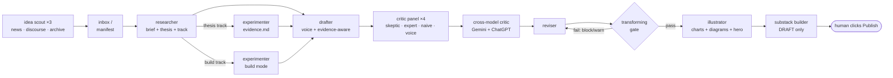

# blog-pipeline

A multi-agent **idea → publish-ready draft** blog pipeline for [Claude Code](https://claude.com/claude-code).
It scouts ideas, researches them, runs real experiments when a claim needs numbers, drafts in
*your* voice, critiques the draft with a multi-lens panel (plus genuine second opinions from
other AI models), revises, illustrates, and assembles the draft in your editor.

**It never publishes. You do.** That boundary is enforced in every stage that goes near a
publish button.

## The pipeline



Ideas live in a Markdown manifest (`blog/pipeline.md`); each has a **track** that decides which
stages run:

| Track | For | Extra stage |
|---|---|---|
| `research` | essay / opinion | — |
| `explainer` | first-principles teaching piece | — |
| `thesis` | a claim that needs real numbers | **experiment** — code in an isolated worktree produces an honest `evidence.md`; negative results are first-class |
| `build` | a post documenting something built | **build** |

Three design choices do most of the work:

- **Voice as a loaded dependency.** Every generative agent reads `blog/voice/` (your guide,
  standing rules, and real writing samples) on every run. Critique includes a dedicated
  voice-editor lens whose job is to protect your sound from generic-AI prose.
- **Evidence-aware honesty.** If an experiment narrowed or refuted the thesis, the draft claims
  the narrowed version — the strong original is not allowed back in. Every post carries a
  "what's real / what isn't yet" ledger.
- **The transforming gate.** After revision, the orchestrator checks that writing the piece
  actually changed a belief from the brief (claim narrowed, assumption dropped, mechanism
  changed). If nothing moved, the piece is a summary wearing an essay's clothes — blocking
  tracks stop; you decide whether to dig deeper or ship anyway.

## Install

```bash
claude plugin marketplace add madhusnagaraj/blog-pipeline
claude plugin install blog-pipeline@blog-pipeline
```

(For a local clone instead of GitHub, point the first command at the clone's path.)

Then, in the project where you want to write:

```
/blog-setup          # scaffolds blog/ — config, manifest, inbox, voice templates, method canon
```

Fill in `blog/voice/` (especially `examples.md` — paste real writing you like; agents imitate
examples far better than adjectives). Then:

```
/blog-pipeline scout            # generate ideas when the well is dry
/blog-pipeline new "<idea>"     # register an idea and research it now
/blog-pipeline next             # advance the most advanced idea one stage
/blog-pipeline                  # show the backlog
```

## Requirements

- **Claude Code** with subagent support (the stages are agents in `agents/`).
- **Optional — Claude in Chrome extension**, for the three browser stages: cross-model
  critiques (Gemini/ChatGPT), styled illustration, and Substack draft assembly. They drive
  *your* logged-in browser; **login is always yours** — the pipeline stops at any auth wall and
  never enters credentials. Without a browser, those stages degrade gracefully (Claude-panel
  critique only, SVG/chart figures, paste-ready HTML instead of editor automation).
- **Optional — a Substack publication.** Other publish targets get paste-ready HTML plus
  instructions instead of editor automation.

## Layout

```
commands/blog-pipeline.md    # the orchestrator (/blog-pipeline)
commands/blog-setup.md       # workspace scaffolder (/blog-setup)
agents/                      # the 9 stage agents
skills/land-worktree/        # optional: land worktree-based writing onto main safely
templates/blog/              # what /blog-setup copies: config, manifest, voice, method canon
```

The `templates/blog/method/` canon encodes published craft literature (Booth et al.'s *Craft of
Research*, Adler's syntopical reading, Schimel's *Writing Science*, Gopen & Swan's
reader-expectation, Bereiter & Scardamalia's knowledge-transforming) as files agents load, so
the pipeline stops rediscovering writing craft one post at a time. Sources are cited inline.

## Safety rails

- Stops at a draft, always. The publish click is yours.
- Never enters credentials anywhere.
- A de-identify instruction, given to every drafting/build/publish-facing agent, has it scan for
  employer/client/product/internal references before anything goes near public output. This is a
  prompted discipline, not a scripted scanner — review the draft yourself before publishing.
- Browser stages run serially — one shared browser, never parallel drivers.
- The `thesis`/`build` track's experimenter writes and runs code on your machine, in an isolated
  git worktree. Review what it does before landing it, the same as any code you'd run yourself.
